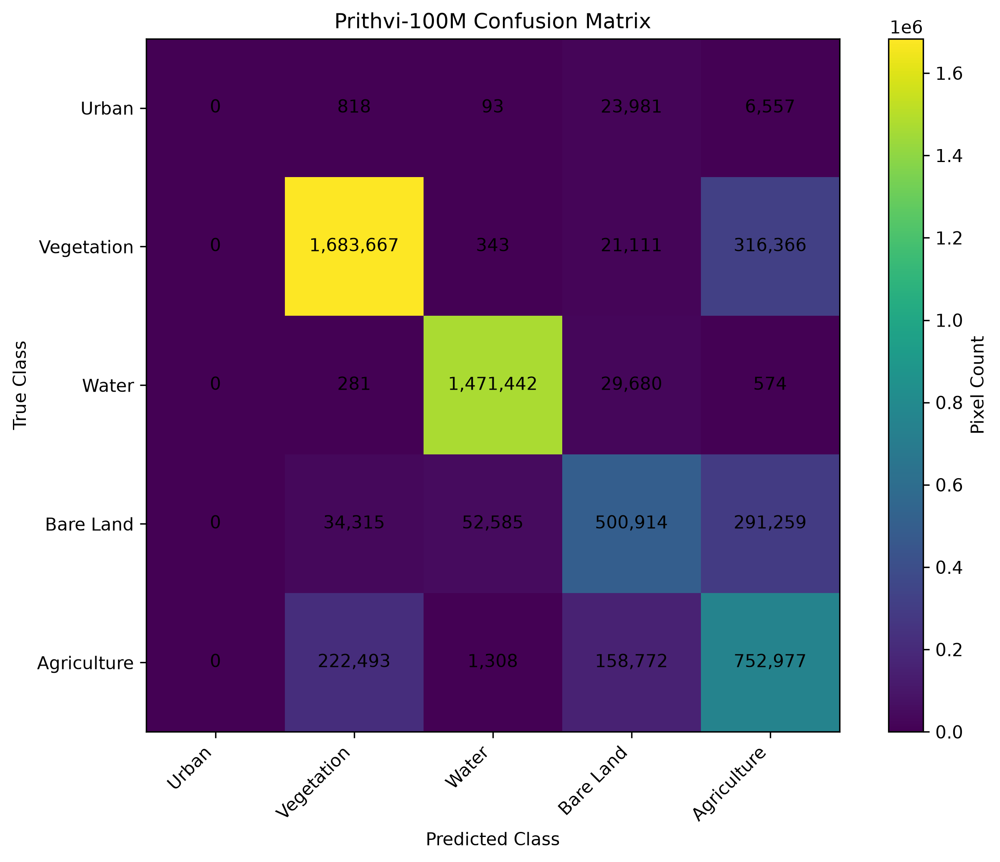

# GeoSense Agent 2.0

GeoSense Agent 2.0 is a geospatial machine-learning workflow for identifying and scoring potential sites in the Mumbai Municipal Corporation (MCGM) study area.

## Project Overview

The project integrates spatial data processing, feature engineering, rule-based site labelling, machine learning, SHAP explainability, automated testing, and a reusable site-scoring function.

## Study Area

Mumbai Municipal Corporation (MCGM), Maharashtra, India.

## Technologies Used

- Python 3.11
- PostgreSQL
- PostGIS
- GeoPandas
- Pandas
- NumPy
- Scikit-learn
- XGBoost
- SHAP
- Rasterio
- Pytest
- QGIS
- Git and GitHub

## Workflow

1. Connect spatial data using PostgreSQL/PostGIS.
2. Generate candidate locations.
3. Calculate spatial features such as distance to roads and hospitals.
4. Create rule-based Good/Poor site labels.
5. Train Random Forest and XGBoost models.
6. Compare model performance.
7. Generate SHAP explanations.
8. Package the model into a reusable `site_scorer.py`.
9. Test the scorer using Pytest.

## Main Outputs

- Candidate location shapefile
- Feature dataset
- Labelled site dataset
- Machine-learning training workflow
- SHAP feature-importance plot
- Reusable site scorer
- Automated tests
## How to Run

Activate the GeoSense environment:

```powershell
conda activate geosense
```

# Phase 2 - Deep Learning and Satellite Imagery

## Phase 2 Overview

Phase 2 extends GeoSense Agent 2.0 with Sentinel-2 satellite imagery, deep-learning-based land-cover classification, Prithvi-100M foundation-model fine-tuning, and NDVI-based change detection for the Mumbai Municipal Corporation study area.

## Satellite Data

Sentinel-2 imagery was prepared for two years:

- 2015
- 2023

Six spectral bands were used:

- B2 - Blue
- B3 - Green
- B4 - Red
- B8 - Near Infrared
- B11 - SWIR
- B12 - SWIR

Images were preprocessed and divided into 224 × 224 pixel image chips.

## Land-Cover Classes

Five land-cover classes were used:

1. Urban / Built-up
2. Dense Vegetation / Forest
3. Water Body
4. Bare Land / Soil
5. Agriculture / Crops

The labels were generated using NDVI, NDWI, and SWIR-based rules.

## U-Net Model

A U-Net model with a ResNet34 encoder was trained using six-channel Sentinel-2 imagery and five land-cover classes.

Best validation accuracy:

**91.24%**

Model files:

- `models/saved/unet_best.pth`
- `models/saved/unet_final.pth`

## Prithvi-100M Fine-Tuning

The Prithvi-100M Earth observation foundation model was adapted for land-cover segmentation using a custom segmentation decoder.

Training configuration:

- Input: 6 spectral bands
- Image size: 224 × 224
- Classes: 5
- Epochs: 20
- Backbone learning rate: 1e-5
- Decoder learning rate: 1e-4
- Optimizer: AdamW

Best validation accuracy:

**79.16%**

Mean IoU:

**51.29%**

### Class-wise IoU

| Class | IoU |
|---|---:|
| Urban / Built-up | 0.00% |
| Dense Vegetation / Forest | 73.86% |
| Water Body | 94.55% |
| Bare Land / Soil | 45.02% |
| Agriculture / Crops | 43.02% |
| **Mean IoU** | **51.29%** |

### Confusion Matrix



The validation evaluation contained **5,569,536 pixels**.

## Image Classification Module

The reusable module:

`src/phase2_dl/image_classifier.py`

provides:

- Land-cover classification
- Class ID
- Classification confidence
- NDVI
- NDWI
- NDVI condition label
- Per-class distribution
- 2015-2023 NDVI change detection
- Change description
- Inference time

The preferred model is Prithvi-100M, with U-Net available as a fallback.

## Change Detection Example

### Changed Location

Coordinates:

**Latitude: 19.239993**  
**Longitude: 72.887024**

| Parameter | Value |
|---|---:|
| NDVI 2015 | 0.824 |
| NDVI 2023 | 0.669 |
| Absolute NDVI change | 0.155 |
| Change threshold | 0.15 |
| Change flag | **True** |
| Land cover | Dense Vegetation / Forest |
| Confidence | 93.4% |

Result:

**Significant land change detected 2015-2023**

### Unchanged Location

Coordinates:

**Latitude: 19.260115**  
**Longitude: 72.786396**

| Parameter | Value |
|---|---:|
| NDVI 2015 | 0.305 |
| NDVI 2023 | 0.270 |
| Absolute NDVI change | 0.036 |
| Change threshold | 0.15 |
| Change flag | **False** |
| Land cover | Dense Vegetation / Forest |
| Confidence | 55.1% |

Result:

**No significant change detected**

## Inference Performance

The classification module was tested using the Prithvi-100M model.

The measured inference times for the changed and unchanged examples were:

- Changed location: **2.757 seconds**
- Unchanged location: **0.576 seconds**

Both are below the **3-second** target.

## Phase 2 Outputs

Important Phase 2 outputs include:

- Sentinel-2 2015 and 2023 processed imagery
- 224 × 224 image chips
- Generated land-cover labels
- U-Net trained model
- Fine-tuned Prithvi-100M model
- Training history
- Class-wise IoU report
- Confusion matrix
- Change-detection candidates
- Reusable `image_classifier.py`

## Phase 2 Status

**Phase 2 core deep-learning workflow: Completed**